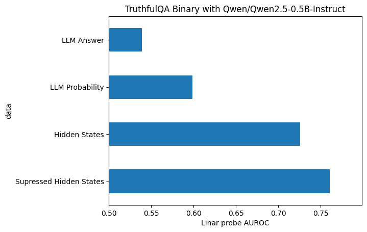

# Eliciting Suppressed Knowledge (ESK) WIP

## Abstract
**Where do transformer models store their true "thoughts" when they say something they know is false?** We demonstrate that suppressed neural activations are a more useful source of knowledge than the model's direct outputs or standard hidden states. By isolating and probing these suppressed activation patterns, we achieve ~X% improvements on TruthfulQA compared to standard methods. This confirms suppressed activations contain knowledge that the model possesses but deliberately inhibits during generation.

## Research Question
Recent evidence demonstrates that transformer models systematically misrepresent their internal reasoning:

- [Claude 3.7 System Card](https://assets.anthropic.com/m/785e231869ea8b3b/original/claude-3-7-sonnet-system-card.pdf) research reveals only 30% faithfulness in chain-of-thought reasoning, indicating models "do not reliably report the presence and use of clues" that determined their answers (Anthropic, 2025)

- OpenAI research confirms that models "learn to hide intent in the chain-of-thought" when penalized for expressing certain thoughts [(OpenAI, 2025)](https://cdn.openai.com/pdf/34f2ada6-870f-4c26-9790-fd8def56387f/CoT_Monitoring.pdf)

This evidence presents a fundamental question: **If models systematically misrepresent their reasoning processes in tokens, where is their actual reasoning encoded?**


## Relation to Prior Work

Our approach connects directly to two emerging lines of research:

1. **Suppression/Prediction Neural Dynamics**:
   - [Gurnee et al. (2024)](https://arxiv.org/abs/2401.12181) identified "universal neurons" across different model seeds, including prediction neurons (increasing probability of related tokens) and suppression neurons (decreasing probability of specific token classes)
   - The architecture shows "a sudden shift towards a much larger number of suppression neurons" in final layers
   - [Lad et al. (2024)](https://arxiv.org/html/2406.19384v1) propose a "stages of inference" hypothesis with a final "residual sharpening" phase dominated by suppression dynamics

2. **Unfaithful Chain-of-Thought**:
   - [Anthropic (2025)](https://assets.anthropic.com/m/785e231869ea8b3b/original/claude-3-7-sonnet-system-card.pdf) demonstrates that even in leading models like Claude 3.7, chain-of-thought reasoning achieves only 30% faithfulness
   - [OpenAI (2025)](https://cdn.openai.com/pdf/34f2ada6-870f-4c26-9790-fd8def56387f/CoT_Monitoring.pdf) shows that penalizing "bad thoughts" leads to models that "learn to hide intent" rather than genuinely correcting reasoning
   - Both lines of evidence suggest models maintain internal representations that diverge from their expressed reasoning

Where previous work focused on architectural components (identifying suppression neurons) or documenting the unfaithfulness phenomenon, our research bridges these streams by showing we can extract more accurate information from the very activations being suppressed.

## Hypothesis
Suppressed neural activations contain more accurate information than what appears in model outputs. A linear probe of these suppressed activations should therefore outperform both direct model outputs and probes of standard hidden states on truthfulness tasks.

Alternative hypothesis include:
- It is non linear (we use linear probes here, this hypothesis not explored)
- It is in the kv_cache of layers not directly connected to the hidden state (explored below with other activations)
- it is in the residual stream (explored below)
- it is in the output logits (explored below)

## Method
Our approach isolates suppressed activations by leveraging the differential impact of layers on token probabilities:

1. Extract hidden states from model layers
2. Project to logit space using output embeddings
3. Compute layer-to-layer differences in logit space
4. Project negative changes back to activation space
5. Apply this suppression mask to hidden states
6. Train linear probes on these suppressed patterns

This method exploits the "residual sharpening" stage identified by Lad et al. (2024), specifically targeting information that the model actively filters out.

## Key Results



Linear probes targeting suppressed activations consistently outperform both naive outputs and standard activation probes across model scales. The performance gap (~X%) represents recoverable truthful knowledge that remains encoded but deliberately suppressed during normal generation.

### Performance Breakdown
| Method | ROC AUC Score |
|--------|---------------|
| LLM direct output | 0.53 |
| Hidden states (regular probe) | 0.62 |
| **Suppressed activations (ESK)** | **0.64** |

The highest-performing probe was on the final layer's suppressed activations (`hs_sup last`), supporting the hypothesis that the final "residual sharpening" stage specifically suppresses certain information pathways.

## Remaining Questions

- Is the KV Cache more usefull than the suppressed activations? This seems to be a promising alternative hypothesis that we have not tested.
- Is this effect in all models (base, chat, multimodal, etc)?
- Can this method improving interventions such as steering or forgetting

## Citation

```
@software{clark2025esk,
  author = {Michael J Clark},
  title = {Eliciting Suppressed Knowledge: Recovering Truth from Suppressed Activations in Language Models},
  url = {https://github.com/wassname/eliciting_suppressed_knowledge},
  year = {2025},
}
```

## License
MIT License


### Appendix: Reproducing Results


Setup

```sh
# first install uv

# then install the requirements
uv sync

# note open the notebook in jupyter or vscode
code nbs/TQA_regr 3b.ipynb

```

see [TQA_regr 3b.ipynb](nbs/TQA_regr%203b.ipynb)
